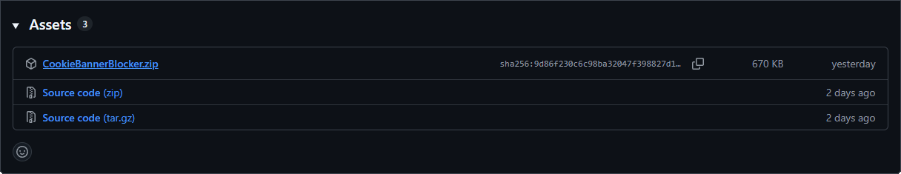
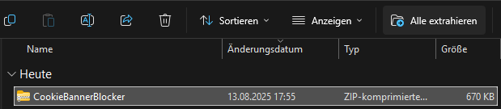
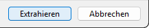
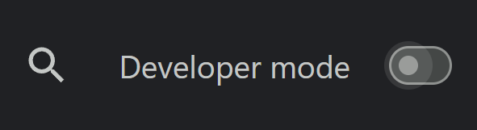
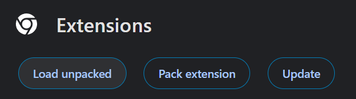
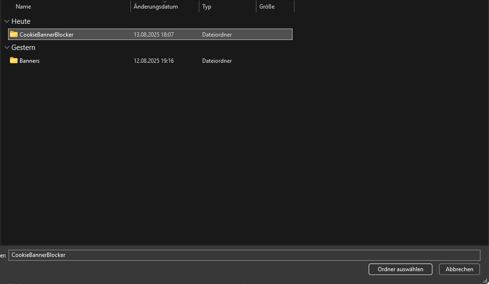
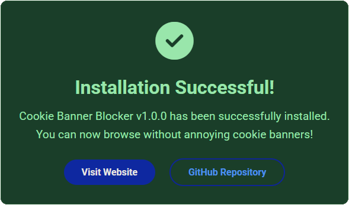

<h1>How to install Cookie Banner Blocker</h1>

<ol>
    <li>
        Download the
        <a href="https://github.com/itsmarianmc/CookieBannerBlocker/releases/latest/download/CookieBannerBlocker.zip">latest release</a>
         
        
    </li>
    <li>
        Extract the downloaded ZIP file to a folder of your choice.
        
         
        Then click on "Extract All" and choose a destination folder.
         
        
    </li>
    <li>
        Open the folder where you extracted the files.
    </li>
    <li>
        Open Chrome and go to <code>chrome://extensions/</code>.
    </li>
    <li>
        Enable "Developer mode" by toggling the switch in the top right corner.
        
    </li>
    <li>
        Click on "Load unpacked" and select the folder where you extracted the extension files.
         
        
         
        
    </li>
    <li>
        The extension should is now installed and active! After a successfull installation, you will see a success message on a website
         
        
    </li>
</ol>