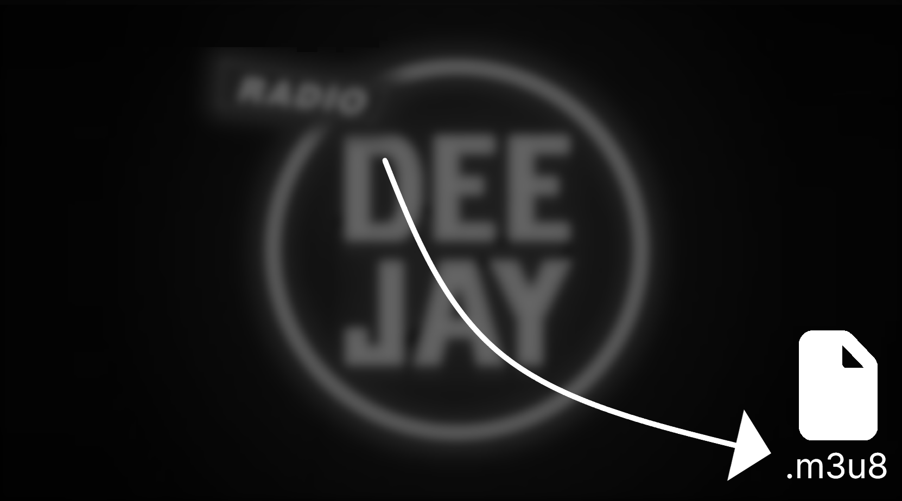

<h1 align="center">M3U8 SCANNER</h1>

Professionally scan all sites for M3U8 files and copy the direct link. Fast, reliable, and easy to use.p>

	

<h1></h1>

    
    
    

    
    
    

<h1></h1>

<h3>Features:</h3>
<ul>
	<li>
		<strong>Deep Scanning:</strong>
		Automatically scans web pages to detect and extract M3U8 stream URLs.
	</li>
	<li>
		<strong>Real-time Detection:</strong>
		Instantly identifies M3U8 streams as you browse websites with live detection.
	</li>
	<li>
		<strong>One-Click Copy:</strong>
		Copy M3U8 URLs directly to clipboard with a single click for easy sharing.
	</li>
	<li>
		<strong>Stream History:</strong>
		Keep track of previously found M3U8 streams with built-in history feature.
	</li>
	<li>
		<strong>Privacy First:</strong>
		No data collection or tracking - your streaming activity stays private.
	</li>
	<li>
		<strong>Browser Extension:</strong>
		Lightweight browser extension that works seamlessly across all websites.
	</li>
	<li>
		<strong>100% Free:</strong>
		Fully functional with no hidden costs or subscriptions
	</li>
	<li>
		<strong>Wide Compatibility:</strong>
		Supports all major cookie banner systems (OneTrust, Cookiebot, Quantcast, etc.)
	</li>
	<li>
		<strong>Open Source:</strong>
		Transparent codebase available on GitHub for inspection and contributions
	</li>
	<li>
		<strong>Regular Updates:</strong>
		Continuously improved with new features and compatibility fixes
	</li>
	<li>
		<strong>No Data Collection:</strong>
		Doesn't collect or transmit any user browsing data
	</li>
	<li>
		<strong>Browser Compatibility:</strong>
		Works with all Chromium-based browsers (Chrome, Edge, Brave, etc.)
	</li>
	<li>
		<strong>Lightweight:</strong>
		Minimal performance impact with small memory footprint
	</li>
	<li>
		<strong>Open Source:</strong>
		Available on GitHub for anyone to inspect, modify, and contribute to the codebase.
	</li>
</ul>

<section>
	<h2>Frequently Asked Questions</h2>
	

		

			<h3>Are there known sites, which still show banners?</h3>
		

		
Yes there are a few, which whether require you to accept the cookies to login or to use other essential features on their sites. Known domains are:

		<ul>
			<li>temu.com</li>
			<li>login.microsoftonline.com</li>
			<li>login.live.com</li>
		</ul>
		
If you still find other sites, please <a href="https://support.itsmarian.is-a.dev/?utm_origin=https://github.com/itsmarianmc/M3U8/&utm_page=M3U8AddOn&page_pos=faq-known-sites-footer">let me know</a>
	

	

		

			<h3>Is this extension legal to use?</h3>
		

		
M3U8 SCANNER is completely legal:

		<ul>
			<li>It doesn't bypass paywalls or access restricted content</li>
			<li>It simply scanns sites for files which you would've found if you would've digged deeper in the code or by checking the "Network" Tab in your browser</li>
			<li>Downloading copyrighted content is strictly prohibited and is not recommended by us.</li>
		</ul>
	

	

		

			<h3>Will this affect website functionality?</h3>
		

		
No, websites function normally. If you experience any problems related to this extension <a href="https://support.itsmarian.is-a.dev/?utm_origin=https://github.com/itsmarianmc/M3U8SCANNER/&utm_page=M3U8SCANNERAddOn&page_pos=faq-website-functionality-contact">contact me</a></li>
		</ul>
	

	

		

			<h3>Does this extension collect any user data?</h3>
		

		
No, M3U8 SCANNER is privacy-focused:

		<ul>
			<li>No browsing history collection</li>
			<li>No personal data tracking</li>
			<li>No telemetry or analytics</li>
			<li>Open source code for complete transparency</li>
			=> If you have further questions about privacy, please read the <a href="https://m3u8scanner.itsmarian.is-a.dev/legal/privacy/">Privacy Policy</a>.</li>
		</ul>
	

	

		

			<h3>Which browsers are supported?</h3>
		

		
Currently supported browsers:

		<ul>
			<li>Google Chrome (all versions)</li>
			<li>Microsoft Edge</li>
			<li>Opera</li>
			<li>Opera GX</li>
		</ul>
	

	

		

			<h3>How often is the scanner updated?</h3>
		

		
I maintain regular update cycles:

		<ul>
			<li>Manual updates when users report issues or I detect an error</li>
			<li>Major version releases every 3-4 months</li>
		</ul>
		
Currently the extension can not be updated automatically, but this feature will come soon!

	

	

		

			<h3>Can website owners detect this extension?</h3>
		

		
Detection is possible but unlikely, because the M3U8 SCANNER doesn't change any elements or update the website's code.

		</ul>
	

	

		
Still have questions? <a href="https://support.itsmarian.is-a.dev/?utm_origin=https://github.com/itsmarianmc/M3U8SCANNER/&utm_page=M3U8SCANNERAddOn&page_pos=footer-still-questions">Contact me</a> or <a href="https://github.com/itsmarianmc/M3U8/issues">open an issue on GitHub</a>.

	

</section>

<h1></h1>

    &copy; 2025 M3U8 SCANNR Ltd. via <a href="https://github.com/itsmarianmc/">itsmarian</a> | All rights reserved.

